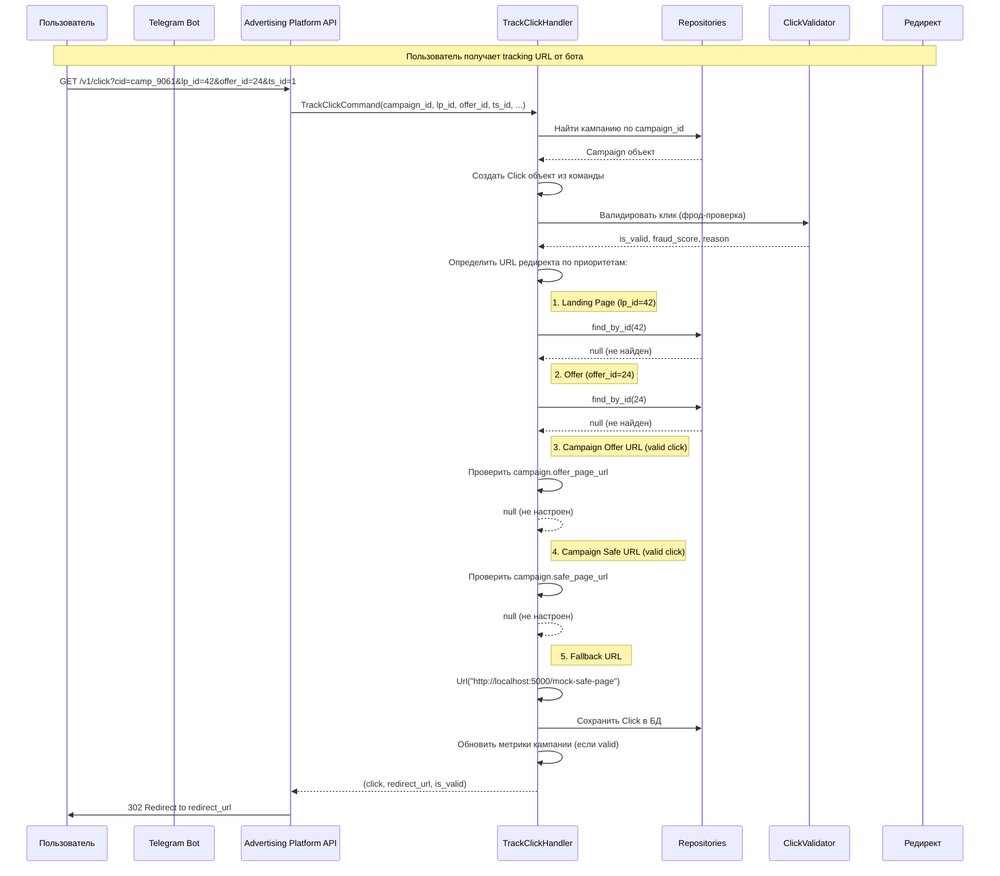
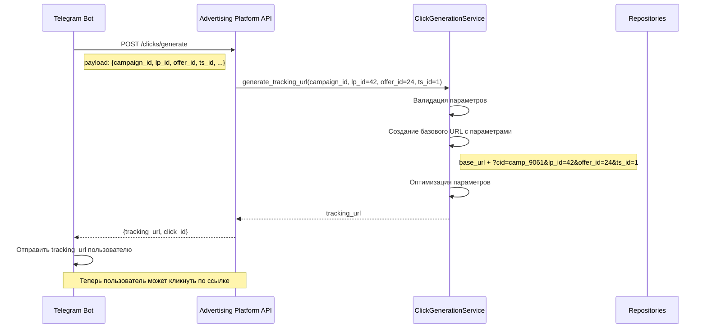

# Диаграмма последовательности: Обработка клика

```mermaid
sequenceDiagram
    participant User as Пользователь
    participant Bot as Telegram Bot
    participant API as Advertising Platform API
    participant Handler as TrackClickHandler
    participant Repo as Repositories
    participant Validator as ClickValidator
    participant Redirect as Редирект

    Note over User,Redirect: Пользователь получает tracking URL от бота

    User->>API: GET /v1/click?cid=camp_9061&lp_id=42&offer_id=24&ts_id=1
    API->>Handler: TrackClickCommand(campaign_id, lp_id, offer_id, ts_id, ...)

    Handler->>Repo: Найти кампанию по campaign_id
    Repo-->>Handler: Campaign объект

    Handler->>Handler: Создать Click объект из команды

    Handler->>Validator: Валидировать клик (фрод-проверка)
    Validator-->>Handler: is_valid, fraud_score, reason

    Handler->>Handler: Определить URL редиректа по приоритетам:
    Note right of Handler: 1. Landing Page (lp_id=42)
    Handler->>Repo: find_by_id(42)
    Repo-->>Handler: null (не найден)

    Note right of Handler: 2. Offer (offer_id=24)
    Handler->>Repo: find_by_id(24)
    Repo-->>Handler: null (не найден)

    Note right of Handler: 3. Campaign Offer URL (valid click)
    Handler->>Handler: Проверить campaign.offer_page_url
    Handler-->>Handler: null (не настроен)

    Note right of Handler: 4. Campaign Safe URL (valid click)
    Handler->>Handler: Проверить campaign.safe_page_url
    Handler-->>Handler: null (не настроен)

    Note right of Handler: 5. Fallback URL
    Handler->>Handler: Url("http://localhost:5000/mock-safe-page")

    Handler->>Repo: Сохранить Click в БД

    Handler->>Handler: Обновить метрики кампании (если valid)

    Handler-->>API: (click, redirect_url, is_valid)

    API->>User: 302 Redirect to redirect_url
```

## Диаграмма последовательности: Генерация Tracking URL

```mermaid
sequenceDiagram
    participant Bot as Telegram Bot
    participant API as Advertising Platform API
    participant Service as ClickGenerationService
    participant Repo as Repositories

    Bot->>API: POST /clicks/generate
    Note right of Bot: payload: {campaign_id, lp_id, offer_id, ts_id, ...}

    API->>Service: generate_tracking_url(campaign_id, lp_id=42, offer_id=24, ts_id=1)

    Service->>Service: Валидация параметров

    Service->>Service: Создание базового URL с параметрами
    Note right of Service: base_url + ?cid=camp_9061&lp_id=42&offer_id=24&ts_id=1

    Service->>Service: Оптимизация параметров

    Service-->>API: tracking_url

    API-->>Bot: {tracking_url, click_id}

    Bot->>Bot: Отправить tracking_url пользователю

    Note over Bot,API: Теперь пользователь может кликнуть по ссылке
```
